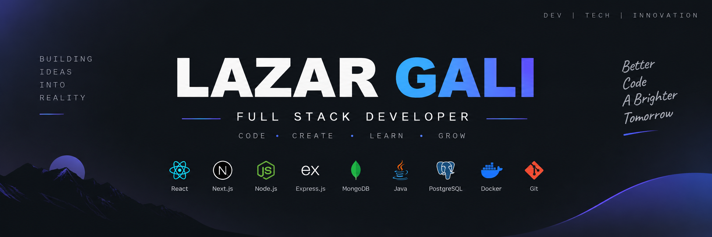

# GALI LAZAR

### Full-Stack Developer ✦ AI Enthusiast ✦ Builder

---

---

## Connect with me

[LinkedIn](https://www.linkedin.com/in/lazar-gali/) •
[Portfolio](https://lazargali-portofolio.netlify.app/) •
[GitHub](https://github.com/GALILAZAR)

